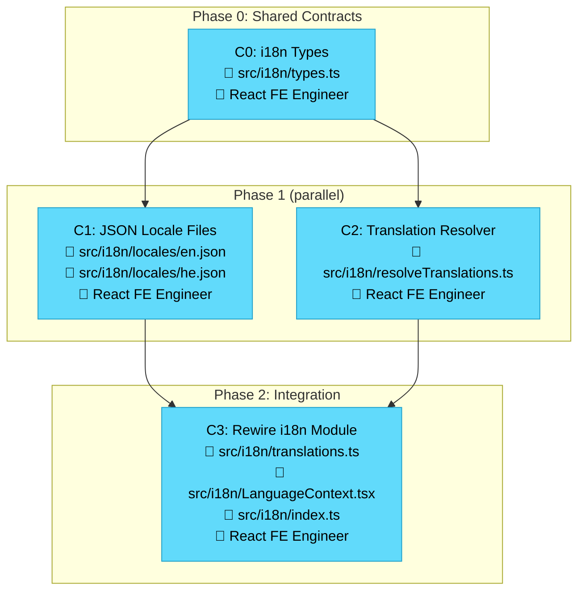

# Implementation Plan — Visual Overview

### Legend
| Color | Agent |
|-------|-------|
| 🔵 Blue | Expert React Frontend Engineer |

### Dependency Summary
- **C0** → no deps (create first)
- **C1, C2** → depend on C0 (can run in parallel)
- **C3** → depends on C0 + C1 + C2 (integration phase)

