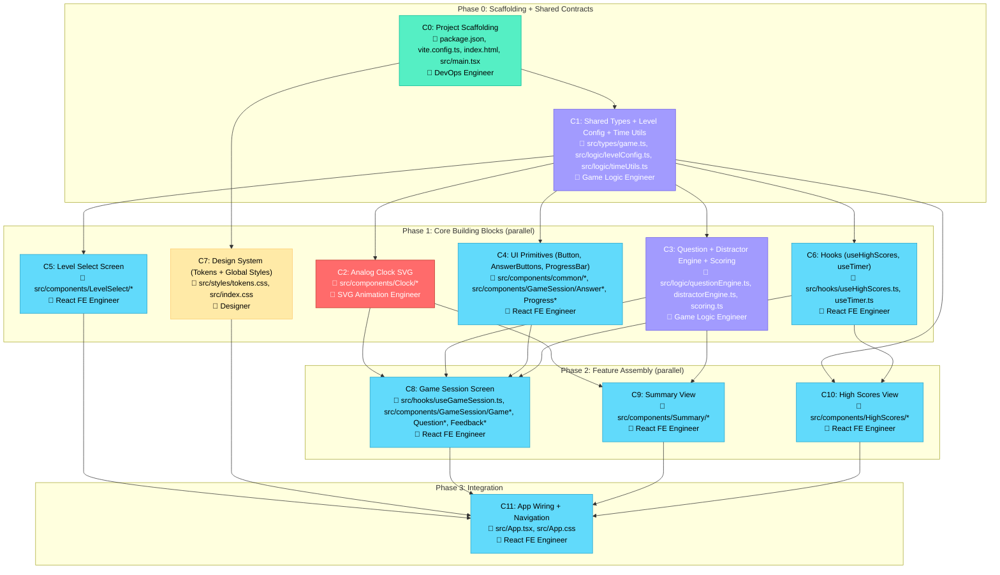

# Implementation Plan — Visual Overview

### Legend
| Color | Agent |
|-------|-------|
| 🟢 Green | DevOps Engineer |
| 🟣 Purple | Game Logic Engineer |
| 🔴 Red | SVG Animation Engineer |
| 🔵 Blue | Expert React Frontend Engineer |
| 🟡 Yellow | Designer |
