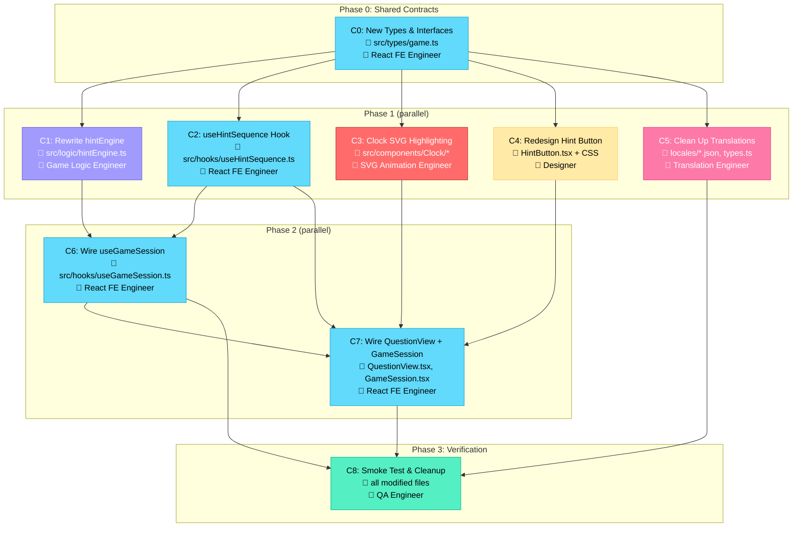

# Implementation Plan — Visual Overview

### Legend
| Color | Agent |
|-------|-------|
| 🔵 Blue | Expert React Frontend Engineer |
| 🔴 Red | SVG Animation Engineer |
| 🟣 Purple | Game Logic Engineer |
| 🟡 Yellow | Designer |
| 🩷 Pink | Translation Engineer |
| 🟢 Green | QA Engineer |

### Dependency Summary
- **Phase 0** (C0) has no dependencies — runs first.
- **Phase 1** (C1–C5) all depend only on C0 — run in parallel.
- **Phase 2** (C6–C7): C6 depends on C0+C1+C2; C7 depends on C2+C3+C4+C6.
- **Phase 3** (C8) depends on C5+C6+C7 — final verification.
