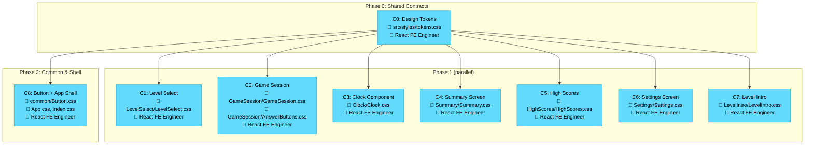

# Implementation Plan — Visual Overview

### Legend
| Color | Agent |
|-------|-------|
| 🔵 Blue | Expert React Frontend Engineer |

### Notes
- All 9 chunks are assigned to the same agent type (Expert React Frontend Engineer) since this is a CSS-only redesign
- Phase 1 chunks (C1–C7) are fully independent — no file overlap, can run in parallel
- Phase 2 (C8) can also run in parallel with Phase 1 since it only depends on C0 (tokens)
- In practice, C1–C8 can all execute simultaneously after C0 completes
