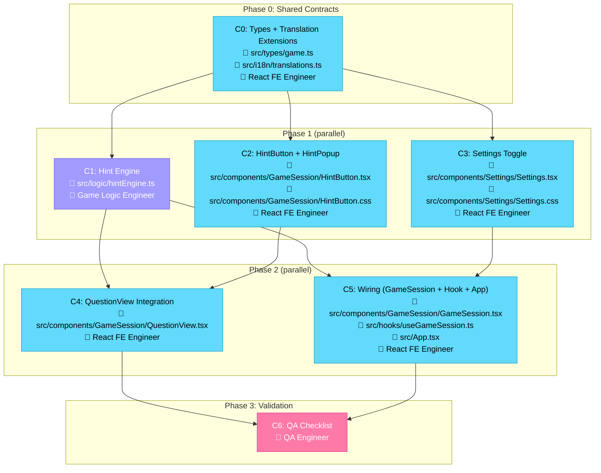

# Implementation Plan — Visual Overview

```mermaid
flowchart TD
    subgraph "Phase 0: Shared Contracts"
        C0["C0: Types + Translation Extensions\n📁 src/types/game.ts\n📁 src/i18n/translations.ts\n🤖 React FE Engineer"]
    end

    subgraph "Phase 1 (parallel)"
        C1["C1: Hint Engine\n📁 src/logic/hintEngine.ts\n🤖 Game Logic Engineer"]
        C2["C2: HintButton + HintPopup\n📁 src/components/GameSession/HintButton.tsx\n📁 src/components/GameSession/HintButton.css\n🤖 React FE Engineer"]
        C3["C3: Settings Toggle\n📁 src/components/Settings/Settings.tsx\n📁 src/components/Settings/Settings.css\n🤖 React FE Engineer"]
    end

    subgraph "Phase 2 (parallel)"
        C4["C4: QuestionView Integration\n📁 src/components/GameSession/QuestionView.tsx\n🤖 React FE Engineer"]
        C5["C5: Wiring (GameSession + Hook + App)\n📁 src/components/GameSession/GameSession.tsx\n📁 src/hooks/useGameSession.ts\n📁 src/App.tsx\n🤖 React FE Engineer"]
    end

    subgraph "Phase 3: Validation"
        C6["C6: QA Checklist\n🤖 QA Engineer"]
    end

    C0 --> C1
    C0 --> C2
    C0 --> C3
    C1 --> C4
    C2 --> C4
    C1 --> C5
    C3 --> C5
    C4 --> C6
    C5 --> C6

    classDef reactfe fill:#61dafb,color:#000,stroke:#21a1cb
    classDef gamelogic fill:#a29bfe,color:#fff,stroke:#6c5ce7
    classDef qa fill:#fd79a8,color:#fff,stroke:#e84393

    class C0,C2,C3,C4,C5 reactfe
    class C1 gamelogic
    class C6 qa
```

### Legend
| Color | Agent |
|-------|-------|
| 🔵 Blue | Expert React Frontend Engineer |
| 🟣 Purple | Game Logic Engineer |
| 🩷 Pink | QA Engineer |

