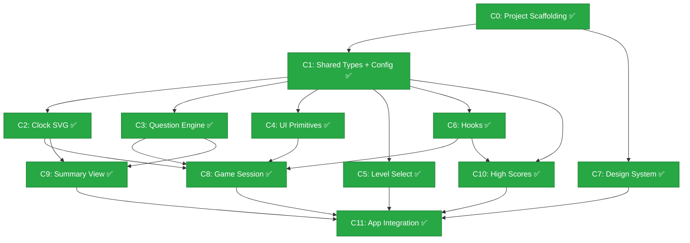

# TeachWatch — Progress Graph

```mermaid
flowchart TD
    C0["C0: Project Scaffolding ✅"]:::done
    C1["C1: Shared Types + Config ✅"]:::done
    C2["C2: Clock SVG ✅"]:::done
    C3["C3: Question Engine ✅"]:::done
    C4["C4: UI Primitives ✅"]:::done
    C5["C5: Level Select ✅"]:::done
    C6["C6: Hooks ✅"]:::done
    C7["C7: Design System ✅"]:::done
    C8["C8: Game Session ✅"]:::done
    C9["C9: Summary View ✅"]:::done
    C10["C10: High Scores ✅"]:::done
    C11["C11: App Integration ✅"]:::done

    C0 --> C1
    C1 --> C2
    C1 --> C3
    C1 --> C4
    C1 --> C5
    C1 --> C6
    C0 --> C7
    C2 --> C8
    C3 --> C8
    C4 --> C8
    C6 --> C8
    C2 --> C9
    C3 --> C9
    C1 --> C10
    C6 --> C10
    C5 --> C11
    C7 --> C11
    C8 --> C11
    C9 --> C11
    C10 --> C11

    classDef done fill:#28a745,color:#fff,stroke:#1e7e34
    classDef inprogress fill:#ffc107,color:#000,stroke:#d39e00
    classDef pending fill:#6c757d,color:#fff,stroke:#545b62
    classDef failed fill:#dc3545,color:#fff,stroke:#bd2130
    classDef fixing fill:#17a2b8,color:#fff,stroke:#117a8b
```
