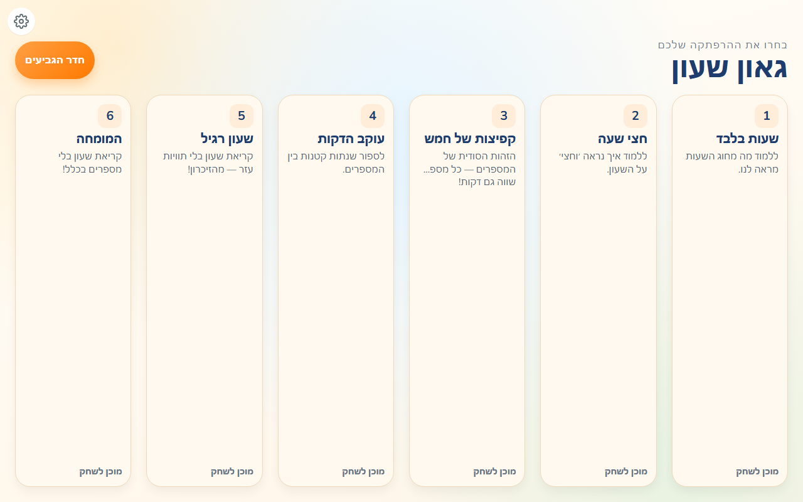
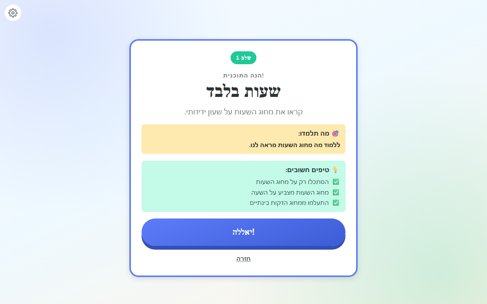
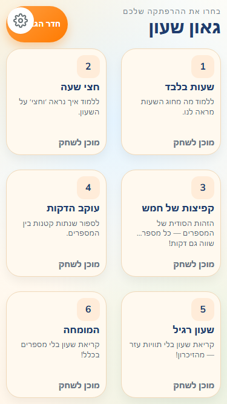
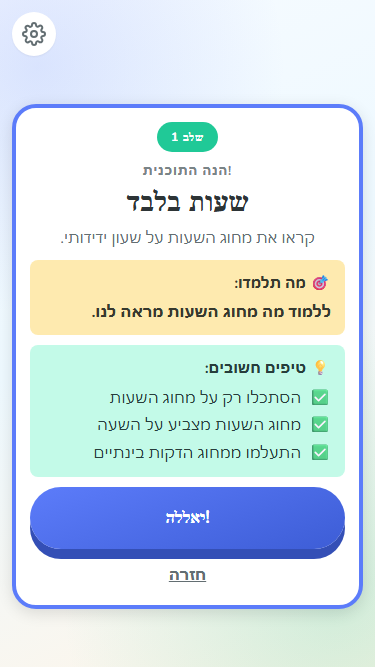

<div align="center">

# 🕐 TeachWatch

**An interactive clock-reading game for kids aged 5–9**

Teach children to read analog clocks through progressive levels, visual hints, and playful feedback — all in the browser.

🌐 **[Play Now → mpmisha.github.io/TeachWatch](https://mpmisha.github.io/TeachWatch/)**

<br/>

| Level Select | Game Session |
|:---:|:---:|
|  |  |

</div>

---

## ✨ Features

- **6 Progressive Levels** — From reading whole hours to decoding a numberless clock face
- **Smart Distractor Engine** — Wrong answers mimic real mistakes kids make (hour traps, mirror traps, swap traps)
- **Two-Stage Visual Hints** — Highlights the hour hand first, then the minute hand, teaching a systematic reading strategy
- **Animated SVG Clock** — Hands sweep smoothly between questions; pulse green on correct answers and wiggle red on mistakes
- **Star Ratings & High Scores** — 1–3 stars per session, with best score, fastest time, and medals persisted locally
- **Bilingual (Hebrew + English)** — Full RTL support with Hebrew as the default language
- **Mobile-First Design** — Touch-friendly 60px+ tap targets, no scrolling required
- **Settings** — Toggle hints on/off, switch language, reset high scores
- **Encouraging Tone** — Celebrates effort, turns mistakes into learning moments with a "Tricky Times" review

## 🎮 Game Flow

```
Level Select → Level Intro → 10 Questions → Summary
```

1. **Level Select** — Pick one of 6 levels, each showing your best score and medal
2. **Level Intro** — See the level name, learning goal, and tips before starting
3. **Game Session** — An SVG clock displays a random time; tap one of 4 answer buttons
   - ✅ Correct: green pulse animation, progress bar advances
   - ❌ Incorrect: red wiggle animation, correct answer highlighted briefly
   - 💡 Hint (optional): two-stage highlight guiding the child's eyes
4. **Summary** — Star rating (9–10 = ⭐⭐⭐, 7–8 = ⭐⭐, ≤6 = ⭐), tricky times review, and action buttons

## 📚 Level Progression

| Level | Name | What's Shown | Time Constraints | Learning Goal |
|:---:|---|---|---|---|
| 1 | **Hours Only** | Hour numbers | `:00` only | Understand the "little hand" |
| 2 | **The Half-Hour** | Numbers + minute ticks | `:00` and `:30` | Intro to the "big hand" |
| 3 | **Five-Minute Jumps** | Numbers + 5-min labels + ticks | Multiples of 5 | Numbers' "secret identity" (4 = :20) |
| 4 | **The Minute Tracker** | Numbers + 5-min labels + ticks | Any minute | Counting individual ticks |
| 5 | **Standard Clock** | Numbers + ticks (no labels) | Any minute | Reading without helpers |
| 6 | **The Expert** | Ticks only (no numbers) | Any minute | Pure spatial orientation |

## 🛠 Tech Stack

| Layer | Technology |
|---|---|
| Framework | [React 19](https://react.dev/) |
| Language | [TypeScript 5.7](https://www.typescriptlang.org/) |
| Build Tool | [Vite 6](https://vite.dev/) |
| Styling | CSS custom properties (design tokens) |
| Clock Rendering | SVG with CSS transitions |
| Internationalization | Custom React Context + JSON locale files |
| Testing | [Playwright](https://playwright.dev/) (Chromium, Firefox, WebKit, Mobile Chrome) |
| Linting | ESLint 9 with React Hooks + React Refresh plugins |
| Deployment | GitHub Pages |
| Persistence | `localStorage` (high scores, language, hints preference) |

## 📁 Project Structure

```
TeachWatch/
├── GameDocs/                  # Game design document
├── public/                    # Static assets
├── screenshots/               # App screenshots (web + mobile)
├── src/
│   ├── components/
│   │   ├── Clock/             # SVG clock: face, hands, animations
│   │   ├── GameSession/       # Question view, answer buttons, hints, progress bar
│   │   ├── HighScores/        # Trophy room with medals
│   │   ├── LevelIntro/        # Pre-game level briefing
│   │   ├── LevelSelect/       # Level picker with score cards
│   │   ├── Settings/          # Language, hints, reset
│   │   ├── Summary/           # Star rating + tricky times review
│   │   └── common/            # Shared UI (Button, LanguageToggle)
│   ├── hooks/                 # useGameSession, useHighScores, useHintSequence, useTimer
│   ├── i18n/                  # Language context, translations, locale JSON files
│   │   └── locales/           # en.json, he.json
│   ├── logic/                 # Pure game logic (no React)
│   │   ├── distractorEngine   # Smart wrong-answer generation
│   │   ├── hintEngine         # Two-stage visual hint computation
│   │   ├── levelConfig        # 6 level definitions
│   │   ├── questionEngine     # Question + options generation
│   │   ├── scoring            # Star rating calculation
│   │   └── timeUtils          # Time formatting and random generation
│   ├── styles/
│   │   └── tokens.css         # Design tokens (colors, typography, spacing)
│   └── types/
│       └── game.ts            # TypeScript interfaces for the entire game
├── e2e/                       # Playwright end-to-end tests
└── .github/
    ├── agents/                # AI agent definitions (10 agents)
    ├── skills/                # Reusable AI skill files
    ├── prompts/               # Prompt templates
    └── workflows/             # Multi-agent workflow definitions
```

## 🚀 Getting Started

### Prerequisites

- [Node.js](https://nodejs.org/) (v18+)
- npm

### Install & Run

```bash
# Clone the repository
git clone https://github.com/mpmisha/TeachWatch.git
cd TeachWatch

# Install dependencies
npm install

# Start the dev server
npm run dev
```

The app will be available at `http://localhost:5173/TeachWatch/`.

### Other Commands

```bash
npm run build        # Type-check + production build
npm run preview      # Preview the production build
npm run lint         # Run ESLint
npm run test:e2e     # Run Playwright end-to-end tests
npm run test:e2e:ui  # Run Playwright tests with interactive UI
```

## 🎨 Design System

TeachWatch uses a CSS custom property–based design token system defined in `src/styles/tokens.css`.

### Color Palette

| Token | Value | Usage |
|---|---|---|
| `--color-primary` | `#5c7cfa` | Main interactive color (bright blue) |
| `--color-success` | `#20c997` | Correct answer feedback (green) |
| `--color-error` | `#ff6b6b` | Incorrect answer feedback (red) |
| `--color-hint` | `#f9a825` | Hint highlighting (amber) |
| `--color-clock-hand-hour` | `#ff6b6b` | Hour hand (red) |
| `--color-clock-hand-minute` | `#5c7cfa` | Minute hand (blue) |
| `--color-gold` | `#fcc419` | Gold medal / 3 stars |
| `--color-silver` | `#b2bec3` | Silver medal / 2 stars |
| `--color-bronze` | `#e17055` | Bronze medal / 1 star |

### Typography

- **Font**: [Nunito](https://fonts.google.com/specimen/Nunito) — rounded, kid-friendly sans-serif
- **Weights**: 400 (normal), 600 (medium), 700 (bold)
- **Scale**: 0.875rem → 2.5rem (14px → 40px)

### Spacing & Touch

- 4px base spacing unit (`--space-1` through `--space-8`)
- Minimum touch target: `60px` (`--touch-min`)
- Border radii: 4px → pill (`--radius-sm` through `--radius-full`)

## 🌍 Internationalization

TeachWatch supports **Hebrew** (default, RTL) and **English** (LTR).

- Language definitions live in `src/i18n/locales/en.json` and `src/i18n/locales/he.json`
- A React Context (`LanguageProvider`) exposes `language`, `setLanguage`, `t` (translation strings), and `dir` (text direction)
- Dynamic translation strings use functions: `startLevel(level, name)`, `levelGameSession(level)`, etc.
- Language preference persists to `localStorage` across sessions
- The language toggle is accessible from both Level Select and Settings screens

## 🤖 AI-Powered Development

TeachWatch was built almost entirely using **GitHub Copilot** with a custom **multi-agent orchestration system**. Ten specialized AI agents collaborate through a structured workflow:

| Agent | Role |
|---|---|
| 🎯 **Orchestrator** | Coordinates all work, maintains progress tracking, delegates to specialists |
| 📋 **Product Manager** | Creates feature specifications with acceptance criteria and edge cases |
| 📐 **Planner** | Designs parallelized implementation plans, breaks specs into tasks |
| ⚛️ **Expert React Frontend Engineer** | Implements React components, hooks, state management, and app logic |
| 🎨 **SVG Animation Engineer** | Clock face rendering, hand rotation math, CSS transition animations |
| 🧮 **Game Logic Engineer** | Question generation, distractor engine, scoring, level progression |
| 🖌️ **Designer** | UI/UX design using Google Stitch MCP for kid-friendly visual design |
| 🔧 **DevOps Engineer** | Project scaffolding, Vite config, build pipeline, GitHub Pages deployment |
| 🧪 **QA Engineer** | End-to-end testing with Playwright across browsers and mobile viewports |
| 🌐 **Translation Engineer** | Localization, kid-friendly copywriting, RTL layout validation |

Agent definitions live in `.github/agents/`, with reusable skills in `.github/skills/` and workflow definitions in `.github/workflows/`.

## 📸 Screenshots

### Desktop

| Level Select | Game Session |
|:---:|:---:|
|  |  |

### Mobile

| Level Select | Game Session |
|:---:|:---:|
|  |  |

## 📄 License

This project does not currently include a license file. All rights reserved.

---

<div align="center">

**Built with ❤️ and 🤖 by human + AI collaboration**

</div>
